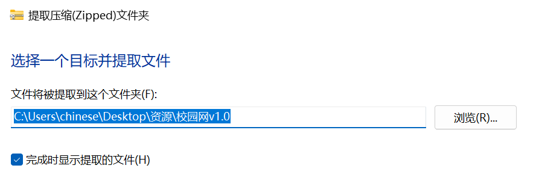
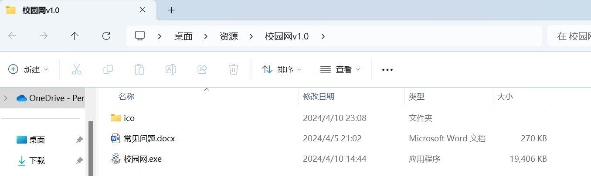
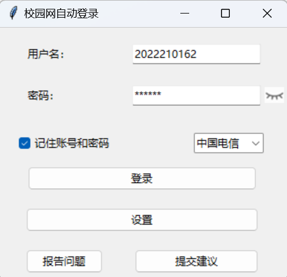
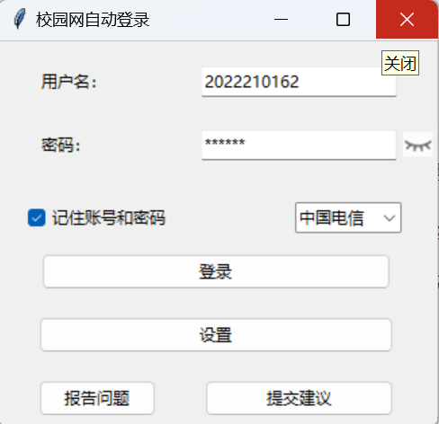
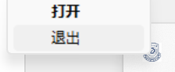
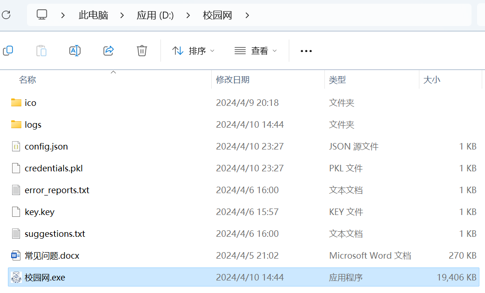

**校园网登录程序**

1. **安装**

选择该文件下载，并然后按照下面的方法解压到合适位置（里面没用文件夹装起来直接解压即可）路径无所谓

解压以后检查文件夹内是否有下面的文件

确认文件完整后即可开始使用

1. 使用程序

双击启动程序，会弹出下面的窗口

输入账号密码后即可登录，如有记住密码的需求勾选即可（不用担心密码泄露，密码会在加密以后再存放在自动生成的用户凭证credentials.pkl中）。登录后会有消息通知登录情况（由于学校网站问题，在已经登录的情况下，就算输出密码也会提示已登录）；登录成功以后界面会缩小到托盘，如需退出请右键托盘图标后选择退出或在界面显示时直接选择叉掉。（小眼睛可以显示或隐藏密码）

如需设置自动登录以及开机自启请点击设置，然后选择性勾选后点击保存即可，程序会自己重启保存设置

1. 反馈和建议

点击报告问题和提交建议后会打开相应的界面，提交后会在程序同目录生成相应的文档，报告问题请将error\_reports.txt和logs一并发给我，提交建议则只需发送suggestions.txt（不用担心个人信息泄露，密码在日志中已做掩盖处理，收集日志只是为了方便寻找错误，并且也不用担心日志文件过大，已经做了定期清理）

1. 注意

程序没有做重复打开限制，所以请确认退出后再再次打开（后续会更新）

界面采用像素模式显示，可能会出现部分电脑显示问题（后续会采用图片作为界面显示）